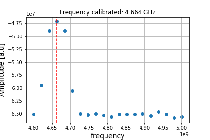

# Iris DataSet Classification 

The Iris is well-known problem that involves the classification of three sets of Iris flowers. It is compose by three classes and 4 properties. In this work, we classify this dataset using a single qutrit in ibmq_bogota.
As IBMQ by default only uses two levels of the transmon qubit, which is in fact an anharmonic oscillator with an infinite set of levels, we need to calibrate subsequent levels in order to use them. This involves finding the transition frequency and the amplitude of the transition. In this work, we present a model for classification of the Iris dataset based only in one qubit, the idea is to use the power of pulse level control for this task:

* Finding the setup of transition to the state $|2\rangle$
    * Finding the frequency of the transition from $|1\rangle$ to $|2\rangle$
    * Finding the amplitude for such transition.
* Classification of the three states with Keras
* Iris data set extraction and normalization
* Paramaetrized circuit for the classification and Cost function model
* Regularization and training

## Frequency calibration

